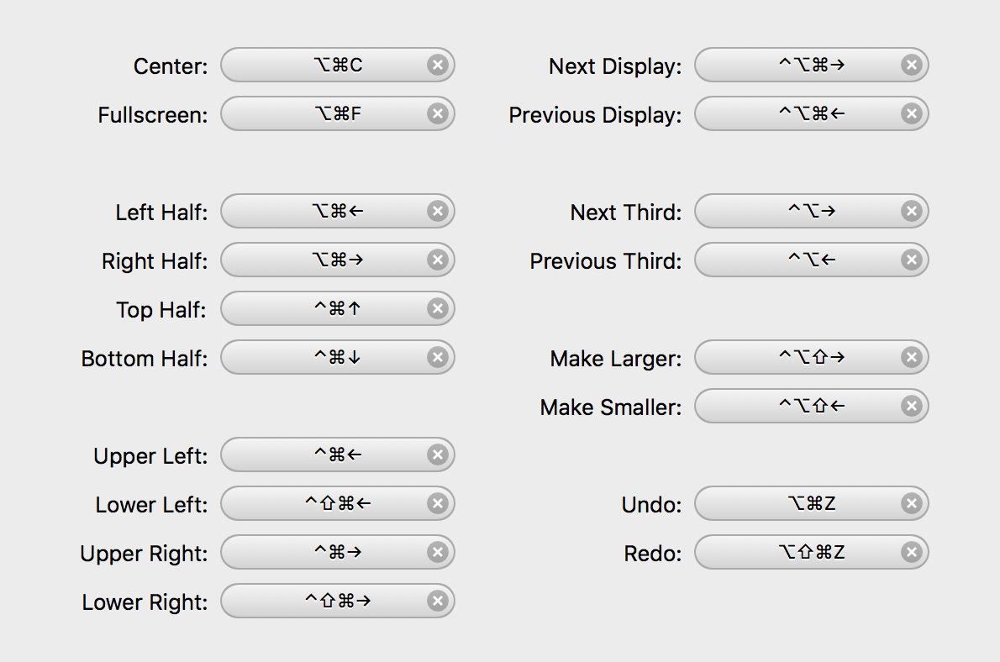

# Installation

## Lesson Objectives

- install `homebrew` and `brew cask`
- install `Node` w/ brew
- install `Spectacle` w/ brew cask
- install `Flycut` w/ brew cask
- install `iTerm` w/ brew cask
- install `Visual Studio Code` w/ brew cask
- Verify git is installed


## Installing Homebrew
<p align="center">
  
</p>

#### What is Homebrew?

Brew is a piece of software that runs in the Terminal. The Homebrew commands can be run from any directory on your computer. Using the Homebrew command `brew` you can install other pieces of software, frequently referred to as packages.

We'll use it to install all kinds of things throughout WDI: from Git and Node to Ruby and Rails.


#### To install homebrew

Here is the link to the [homebrew documentation](http://brew.sh/), which explain what homebrew is, how to use it, and how to install it.

You start to get into the habit of always reading the documentation for any tool, package, or language we use in class. It will be overwhelming at first and you might only understand a small percentage of what you're reading. But developing this habit early, is essential for your success in the class and your success as a developer.


According to the documentation we simple have to paste the following command into our Terminal and then restart and we'll have homebrew successfully installed.

> When we say **"Run this command,"** it means type or paste the command into the terminal and hit enter."

1. Run this command in the Terminal

  ```bash
  /usr/bin/ruby -e "$(curl -fsSL https://raw.githubusercontent.com/Homebrew/install/master/install)"
  ```

  After a minute or so you should see a message like this one.  (Don't worry if your colors are slightly different)

  

2. We've successfully installed our first command line app! Restart your Terminal and lets use `brew` to install other tools.

3. To test that brew successfully installed we need to try and run the base command. If you run `$ brew` in the Terminal you should see what looks like a manual page. This is almost ubiquitous for Terminal applications.

  run these commands in bash:

  ```bash
  $ brew update
  $ brew upgrade
  ```

If brew is used to install packages you might guess what our next step is... We're going to install a package!

Node.js is one of the major tools we are going to use throughout this course.  We don't need to know what it does just yet, but lets go ahead and get it installed using brew:

1. Run the following command from any directory:

  ```bash
  brew install node
  ```

2. If everything goes well, you should see something like this... 

> Don't worry too much about anything that says 'WARNING'.  As a rule of thumb, warnings don't necessarily mean that it's failed. If you get 'ERRORS', make sure to grab an instructor.


## Installing Brew Cask

#### What is Brew Cask?

Where Homebrew lets us install packages and tools for the Terminal and other low level processes, `brew cask` let's us install Apps. Things like Chrome, Atom or Sublime Text, Spectacle, Slack and so on!

It's an important but simple difference:

  *Use Brew To Install Languages and Command Line Tools* aka Tools without a UI (User Interface)

  *Use Brew Cask To Install Apps* aka Tools with a UI (User Interface)

#### To Install Brew Cask

According the [documentation](https://caskroom.github.io/) we need to run the following command in our terminal and then restart.

1. Run this command in the Terminal

```bash
  $ brew tap caskroom/cask
```

2. Restart your terminal.

> Did You Know: You don't have to close out the program in order to restart your terminal.  Try writing `source ~/.bash_profile` instead.

Now you'll be able to install regular applications like Chrome using the command `$ brew cask install`


### Installing Our Text Editor


You may already have VS Code or another text editor installed but I'm going to ask you to uninstall it by dragging the application to the trash and emptying it. Instead, we're going to install VS Code using brew cask.

```bash
$ brew cask install visual-studio-code
```

Why did we do that? Because we installed using brew cask, it created a command in our terminal so if we run the command `code` and we give it a file or directory name/path it will open it in VSCode.

Let's test it out.

### Set up Spectacle, iTerm, and Flycut

We're going to install a few more applications using brew cask. 

# Spectacle


The first is an app called [Spectacle](https://github.com/eczarny/spectacle) which is going to make organizing your screen much simpler!

1. using `brew cask`:
  ```bash
  $ brew cask install spectacle
  ```
  
2. Open Spectacle from Spotlight (`cmd + space`)

3. Update system preferences for Spectacle:

  Click the padlock in the bottom left corner so you can make changes and then check the box next to Spectacle to allow the app to control your computer.

  Spectacle gives you the ability to move your windows around quickly so you're not wasting time dragging your mouse around.
  
  Here are all of the shortcuts that Spectacle gives you

  

| Symbol        | Meaning           | 
| ------------- |:-------------:| 
| ⌘  | Command Key | 
| ⌥  | Option Key | 
| ⌃  | Control Key | 
| ⇧  | Shift Key | 

# Flycut


The second is a clipboard manager called [Flycut](https://github.com/TermiT/Flycut). This will allow us to copy multiple things in a row and then paste all of them later, instead of the standard one at a time.


1. using `brew cask`:

  ```bash
  $ brew cask install flycut
  ```
  
2. Open Flycut from Spotlight

3. Select "Launch Flycut on Login" from the Flycut preferences. (It's the red icon near your clock.)

4. Now when you press `⌘ + ⇧ + V` you can select from your 40 most recent items on your clip board

# iTerm


Finally, we'll install a new, upgraded Terminal application called `iTerm`.
1. using `brew cask`:

  ```bash
  $ brew cask install iterm2
  ```
  
2. Open iTerm from Spotlight

3. Open the iTerm preferences with `cmd + ,`

4. Go to the `Profiles` tab and under the `Working Directory` section, select "Reuse previous session's directory." This will enable us to open multiple terminal panes easily within the same root folder. This will become more and more useful for us over the life of the class.

# Extra: Command Line Helpers w/ Bash-It

You might notice the instructors command line looks a little different than what you have.  Over time, you may find all sorts of tools and scripts to customize your development environment.  

One popular tool is called [Bash-It](https://github.com/Bash-it/bash-it). Bash-it is a collection of a lot of different scripts and tools to help you be a more effective developer.  It includes helpers that keep track of git, provide more colors, and is highly customizable.  

You can install bash-it by running the following commands

```
$ git clone --depth=1 https://github.com/Bash-it/bash-it.git ~/.bash_it
$ ~/.bash_it/install.sh --silent
```
