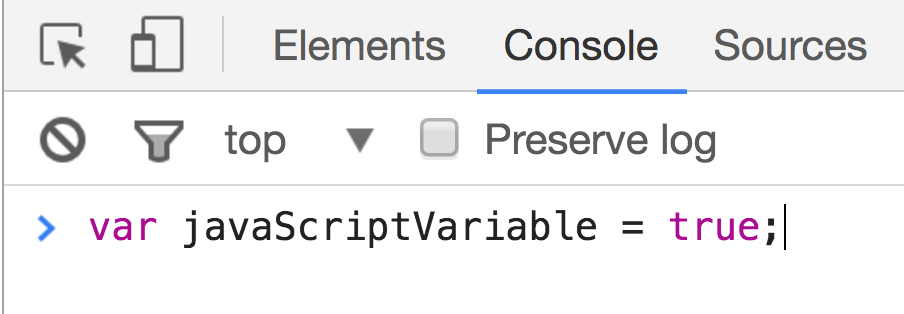

# Intro to Javascript

## Learning Objectives

- Describe the role Javascript plays alongside HTML and CSS
- List and describe the primitive data types and common complex data types
- Practice proper JS syntax and semantic variable naming
- Describe uses of mathematical operators in Javascript
- Define type coercion
- Explain the difference between `prompt` and `console.log`
- Differentiate between `true` & `false` && "truthy" & "falsey"
- Write an `if`-`else if`-`else` statement in JS and describe how control flow is used in programming
- Write a `for` loop and `while` loop, differentiate between them and use loops to iterate through complex data types

## Framing (5 minutes / 0:05)

We've dabbled with HTML and CSS. There's a bit of interactivity we can program through CSS but not nearly enough! How can we start to add logic, data-handling and behaviors to our web apps? Enter Javascript.

### HTML, CSS and Javascript

HTML, CSS and Javascript are technologies, which serve as the basic components of front-end development. Front-end frameworks and libraries that add layers of abstraction (i.e., the ability to do more with less code) make use of these three technologies.

#### If a web application or website were a building...

##### HTML: Structure and Content

HTML would be like the most stripped-down version of that building -- just the structure of the building, the building materials, and some content (maybe unfurnished offices, an empty classroom, a set of not-yet-operational bowling-lanes, etc).

##### CSS: Styling

CSS is responsible for the appearance of the building, adding granite floors, polished doors, wooden railings, etc. CSS styles the content of a website to look like more than just black text on a white background.

##### Javascript: Behavior & Functionality

Javascript might be like the building's elevator systems, ID-scanning & entry systems. Javascript handles interactivity and data.

## Think-Pair-Share: Cookie Clicker (10 minutes / 0:15)

> 5 minutes exercise. 5 minutes review.

**Spend 2 minutes** playing with [Cookie Clicker](http://orteil.dashnet.org/cookieclicker/). Think about how the page responds to your actions. What is allowing these behaviors to exist?

**Spend 3 minutes** comparing your individual findings in pairs. With your partner, [file an issue](https://github.com/ga-wdi-lessons/js-intro/issues/new) on the lesson repo including three features that you think are powered by Javascript.

### Findings

#### Interactivity

Javascript allows us to write code that is executed in response to user interaction
* Clicking the cookie: increment the cookie total
* Liking something on Facebook: increment Like counter
* Submitting a Facebook comment: submit comment, appended to post

#### No Refreshes ➡ 👍 User Experience

Cookie Clicker updates the page without requiring a full refresh, making for a smoother user experience
* When I click a cookie, Cookie Clicker is able to update the counter without a hard refresh
* When I comment on a post, Facebook is able to process the new comment and render it without refreshing the entire page

#### Communication with Servers

While this isn't the case with Cookie Clicker, Javascript has the ability to communicate with an external server. This means we could...
* Store data associated with some user interaction into a database (e.g., cookie quantity, form data, contents of a post)
* Retrieve information that needs to be displayed on a webpage (e.g., latest cookie quantity, user achievements)

> Cookie Clicker uses the browser's [`localStorage`](https://developer.mozilla.org/en-US/docs/Web/API/Window/localStorage) you save information

This is not an exhaustive list of Javascript properties, but we'll go over these and more in greater detail later on in the course.

So, to sum up the main three components of front-end web development up in one word each...
* HTML: Structure
* CSS: Styling
* Javascript: Behavior

## Javascript: The Client-Side Programming Language of the Web (5 Minutes / 0:20)

<details>
<summary><strong>What's a programming language? What can it do that a markup language like HTML can't?</strong></summary>

  > It lets us do things! It lets us act on information, manipulate it, display it, pretty much whatever we want.
  >
  > Javascript enables us to do all that in a browser (i.e., client-side) using the tools you learned in the pre-work like data types, loops and functions.

</details>
<br>

Brief history: Javascript was created in 10 days by [Brendan Eich](https://en.wikipedia.org/wiki/Brendan_Eich) of Netscape/Mozilla.
* The programming language is not related to Java in any way but its name. "Java" is to "Javascript" as "ham" is to "hamster."
* Javascript has since gone through multiple iterations, the latest being ECMA Script 6 (ES6/2015)


### Why is it the dominant programming language of the web?

Barriers to entry for learning Javascript are very low. No additional software required to run it. Just a text editor and a browser.
- You can even run it directly in the browser via its Javascript console
- Ex. hide images on ESPN website

Javascript is supported by all web browsers.
- [Some browsers](https://developer.mozilla.org/en-US/Add-ons/WebExtensions/Browser_support_for_JavaScript_APIs) support more features than others

Javascript continues to evolve.
- One of the biggest additions to the language was AJAX, which allows use to reload parts of a page without refreshing the entire thing. This had huge implications for user experience.

A lot of Javascript frameworks and libraries (e.g., jQuery, React) have emerged that enable us to do so much more with Javascript (and do it quickly).

## Setting Up Our Environment (5 minutes / 0:25)

We're going to spend the next few minutes learning how to set up our development environment, or our work area for working with Javascript. As far as development environments go, this is about as simple as it gets! If it feels unfamiliar and cumbersome to set up at first, don't worry -- speed quickly comes with repetition.

### Steps

1. [Create files](#filecreate)
2. Save changes to file(s)
    - `⌘ S`
3. [Open files in chrome and open chrome console](#openinchrome)
    - `⌘ TAB` to switch to Chrome, if open
    - If Chrome isn't open, `⌘ [SPACE]` to open Spotlight (Max OS X Finder Speed Search), and then type Chrome and hit enter when the Chrome icon appears

<a name="filecreate"></a>
#### Create `index.html` and `script.js` Files

Creating a JS intro directory that contains an `index.html` and `script.js` file. If you already have a `wdi` directory with contains a `sandbox` directory, you can run the below Terminal commands...

```bash
cd ~/wdi/sandbox
touch index.html script.js
```

The `index.html` and `script.js` files should contain the following...

```html
<!-- index.html -->

<!DOCTYPE html>
<html>
  <head>
    <title>This is the Title</title>
  </head>
  <body>
  <script src="script.js"></script>
  </body>
</html>
```

```js
// script.js

console.log("hello world")
```

You can also put your script tag in the head. Putting the tag in the body ensures that the rest of the page loads before your script files run. Also of note, [HTML5 added two attributes ](http://www.growingwiththeweb.com/2014/02/async-vs-defer-attributes.html) that increase control when scripts load and run.

<a name="openinchrome"></a>
## Open Chrome & Dev Tools

Open the javascript console with Command + Option + J (`⌘ + ⌥ + J`)

You should see something like this, but without the example of a javascript expression that declares a variable.



### The Console as a REPL

The "Console" is an example of a REPL, which is a tool for testing and debugging code. REPL is an acronym that stands for “Read, Evaluate, Print, Loop”.

Think of the REPL as being simply like scratch-paper for code. It's a small programming environment that lets us run Javascript code one line at a time.

What does it do?
  1. (**R**)eads our code.
  2. (**E**)valuates expressions.
  3. (**P**)rints the result to the console, if any (some things result in or ***return*** `undefined`).
  4. Then it (**L**)oops back to the beginning, ready to (**R**)ead the next line of code we feed it. It 'listens' for new code.

> In Chrome, `⌘ + ⌥ + i` opens the chrome dev tools. Here you can do a bunch of stuff like inspect elements and see HTML, CSS and scripts the page has loaded. It allows you to access the console which interacts with the JS that the page has loaded. In our case we'll see that interaction with the code below

------

## Exercises

The rest of the lesson consists of guided exercises. The goal behind these is to increase your familiarity with Javascript by analyzing the output of different Javascript expressions.

For each exercise you will be working in pairs.

### Setup

1. Clone down the [data types repo here](https://github.com/ga-wdi-exercises/js-data-types)
2. In Atom, open [exercise.md](https://github.com/ga-wdi-exercises/js-data-types/blob/master/exercise.md). You will use this as the worksheet for the next three exercises.

## You Do: Data Types & Data Structures (25 minutes / 0:50)

Complete the **Data Types** and **Data Structures** exercises in [`exercise.md`](https://github.com/ga-wdi-exercises/js-data-types/blob/master/exercise.md)

> You can use the [Data Types And Collections](./data-types-and-collections.md) readme as reference and review.

### Review (10 minutes / 1:00)

## Break (10 minutes / 1:10)

## You Do: Booleans & Conditionals (25 minutes / 1:35)

Complete the **Booleans & Comparison Operators** and **Conditionals** exercises in [`exercise.md`](https://github.com/ga-wdi-exercises/js-data-types/blob/master/exercise.md)

> You can use the [Booleans and Conditionals](./booleans-and-conditionals.md) readme as reference and review.

### Review (10 minutes / 1:45)

## You Do: Loops (20 minutes / 2:05)

Complete the **Loops** exercise in [`exercise.md`](https://github.com/ga-wdi-exercises/js-data-types/blob/master/exercise.md)

> You can use the [Loops](./loops.md) readme as reference and review.

### Review (10 minutes / 2:15)

---------

> If time remains in the lesson...

## Getting User Input & Conditionals

**You will need to read the following sections to complete this lesson's homework assignment.**

### `.prompt()`

We've learned about basic data types, but it'd be nice if we had a way of getting user input into our browser. We'll learn some ways to use forms and such later in the course, but for now, we'll be getting user input using the `prompt()` function.

At any point in our JS code, if we write `prompt()`, a pop up box will open in our browser for a user to enter in text.

```js
// prompts user and stores value in the variable
var valueOfPrompt = prompt()
// logs value stored
console.log(valueOfPrompt)
```

You can also pass in a string as an argument to have the pop up box contain that string as a ... prompt.

```js
var age = prompt("How old are you?")
// ES6 String Interpolation
alert(`You are ${age} years old.`)
// ES5 Version
alert("You are " + age + " years old.")
```

Whatever we type into the textbox in the window that `prompt()` brings up, is **returned** by prompt to the variable `age`.

### Adding Conditionals

Let's say, we were deciding whether or not to let someone inside of a club.

```js
var age = prompt("How old are you?")
alert(`You are ${age} years old.`)

if (age >= 21) {
  alert("Welcome to the club")
} else if (age < 21 && age > 0) {
  alert( "You are too young :(" )
} else {
  alert("Your age is not a number (NaN) or is negative. Invalid input.")
}
```

## You Do: [Temperature Converter](https://github.com/ga-wdi-exercises/temperature_converter)

-------

## Homework

* [Choose Your Own Adventure](https://github.com/ga-wdi-exercises/choose_your_own_adventure_js)

## Review Questions

1. What role does Javascript play on a website?
2. What is the difference between `undefined` and `null`?
3. What are the five primitive data types?
4. What is an example of type coercion?

## Additional Exercises

* [Luhn Algorithm](https://github.com/ga-wdi-exercises/luhn_algorithm#challenge-validating-credit-card-numbers)
* [Anagram Detector](https://github.com/ga-wdi-exercises/anagrammer#anagram-detector)

-------

# Additional Notes

## Syntax

### Semicolons
- General practice is to end every line with a semi-colon, though you may see JS code without any semi-colons
- Usage depends on the developer

### camelCase

Javascript variables and function names are written using camel case syntax. That works
- First letter of first word lowercase
- First letter of remaining words uppercase
- No spaces or punctuation between words

#### Examples

```js
var pizzaTopping = "pepperoni"
var isThisVarCamelCase = true

// Function expression
var helloWorld = function(){
  console.log("Hello World!")
}

// Function declaration
function helloWorld(){
  console.log("Hello World!")
}
```

### Comments

Comments are an extremely important part of writing code. They help us make sense of our code, especially for other people reading our code, or when we have walked away from some code and have completely forgotten what certain sections of it do. This happens much more quickly than you may imagine.

If you are working on a team, your documentation and commenting practices often translate to how easy you are to work with!

```js
// Single line comment

/*
  Multiple
  line
  comments
*/
```
